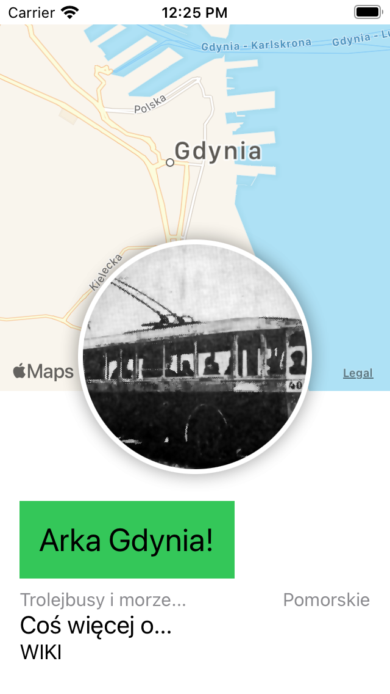
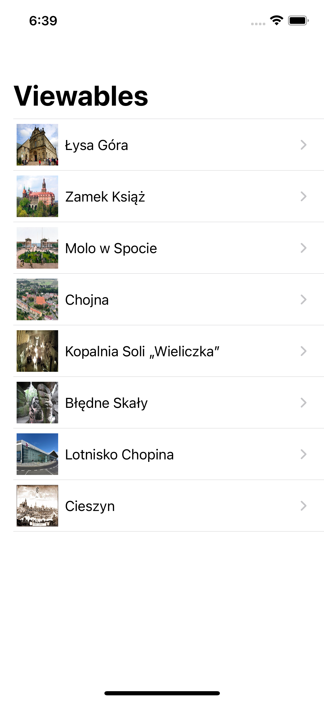

# MyTutorial

[from here](https://developer.apple.com/tutorials/swiftui/creating-and-combining-views)

## second part of the tutorial

[here](https://developer.apple.com/tutorials/swiftui/building-lists-and-navigation)

after modifing `landmarkData.json` to look like [this](./Shared/Resources/polskieGóry.json), all led me to creating my own landmark list

